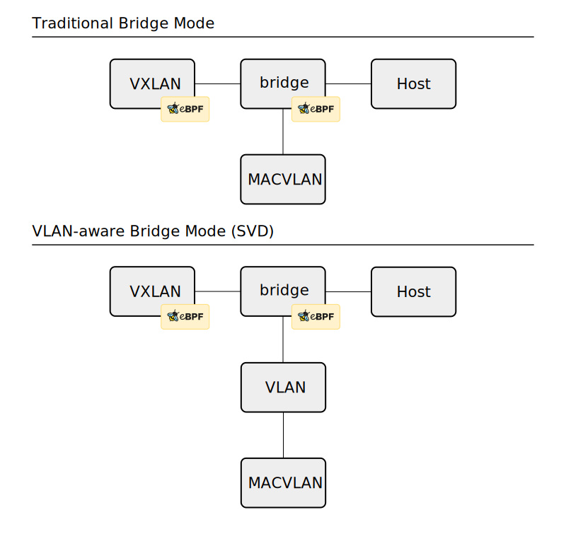
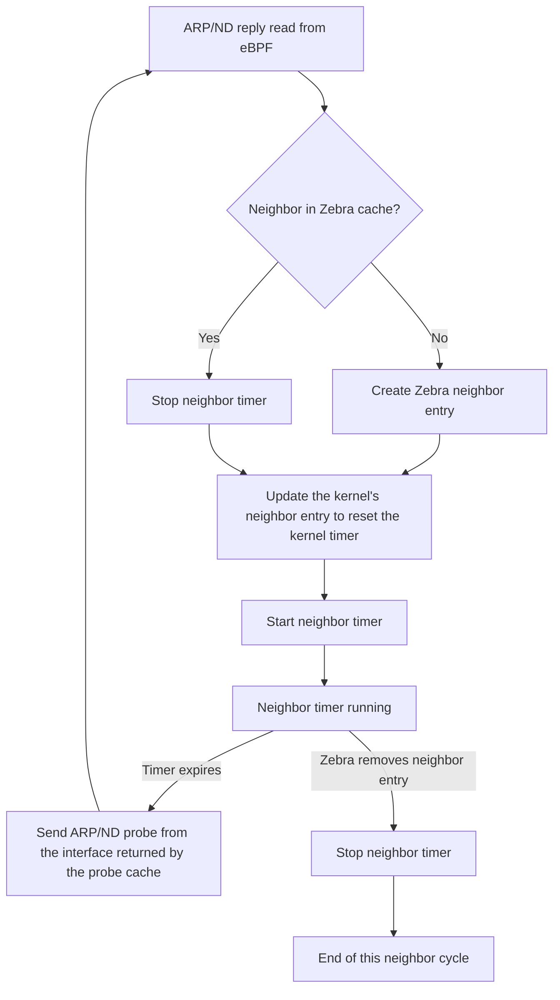

# FRR: Neighbor Manager

This design document outlines the new Neighbor Manager (neighmgr) functionality for FRR. The current draft is based on the original architecture by [1984](https://www.1984.is). It focuses on the [L2-EVPN](../scenario/L2-EVPN.md) scenario. This document serves as an initial reference as we determine scenarios and design choices.

The original 1984 design has three functions to solve the issues in [L2-EVPN](../scenario/L2-EVPN.md):
- Snoop ARP/ND replies from hosts and register those neighbors in the Linux kernel and Zebra.
- Ignore ARP/ND snooping replies that come from VXLAN devices.
- Send periodic ARP/ND probes to the learned hosts to keep the neighbor cache from timing them out to prevent unnecessary synchronization noise.


## Snooping

Linux and FRR implement EVPN using the vxlan, bridge, and 8021q drivers, as shown in [Figure 1](topology.svg). In the Linux kernel, the VXLAN interface uses a bridge device as its upper device. This bridge can be a traditional bridge or a VLAN-aware bridge. With a VLAN-aware bridge, a single VXLAN device is sufficient for all VNIs. Connecting and enabling these interfaces establishes the foundation for EVPN. Switch Virtual Interfaces (SVIs) are configured by attaching a MACVLAN device to a bridge or connecting a VLAN interface to a VLAN-aware bridge. Both of these devices represent SVIs in FRR.



Figure 1 (Attribution details available in [ATTRIBUTIONS.md](../ATTRIBUTIONS.md).)

The design loads two TC eBPF filters, one attached to the VXLAN and one to the bridge interface. These TC eBPF programs run in the kernel, parsing packets traversing the attached interfaces. The bridge device parses ARP or ND replies, then stores the resulting struct in an eBPF ring buffer:

```C
struct neighbor_reply {
    __u8 mac[6];
    __be32 vlan_id; // Only used on VLAN-aware bridges

    union {
        struct in_addr _v4_addr;
        struct in6_addr _v6_addr;
    } ip;

    __u8 in_family;
};
```

The Neighbor Manager polls the eBPF ring buffer for new structs by calling event_add_read on an eBPF-provided file descriptor.

The TC eBPF program on the VXLAN interface sets the fwmark field on packets, allowing the bridge eBPF code to skip their parsing.


## Probing

The probing functionality relies on a cache that selects the network interface for each probe. If no interface on the neighbor’s network has an IP address, the system performs IPv4 Address Conflict Detection (ACD, [RFC 5227](https://www.rfc-editor.org/rfc/rfc5227)) or IPv6 Duplicate Address Detection (DAD, [RFC 4862](https://www.rfc-editor.org/rfc/rfc4862)). If a suitable IP address is found, ARP or ND probes are sent from that interface. Since interfaces can change dynamically, subsequent probes may use different interfaces.


### Probe Cache

The design of the probe source interface is as follows:

```
VNI  
├─ IPv4 table
│    └─ network prefixes  
│         └─ interface + network + IP  
│  
└─ IPv6 table  
     └─ network prefixes  
          └─ interface + network + IP
```

The cache is indexed by VNI and uses longest-prefix matching, analogous to routing. This lookup returns the interface and source IP that most closely match the probe.

An example of the cache with network addresses is depicted here:

```
VNI 840601
 ├─ IPv4
 │   └─ 0.0.0.0/0 → vxb840601 (SVI)
 │   └─ 93.95.225.128/25 → vxb840601-v0 (MACVLAN)
 │
 └─ IPv6
     ├─ ::/0 → vxb840601 (SVI)
     ├─ 2a00:5ee0:2000::/48
     │    ├─ vxb840601 (SVI)
     │    └─ vxb840601-v0 (MACVLAN)
     └─ fe80::/64 → vxb840601-v0 (MACVLAN)
```

By default, each SVI is assigned 0.0.0.0/0, serving as a catch-all when no other route matches. Other interfaces, such as MACVLAN interfaces, can have additional IP addresses that could send probes. Depending on the configuration, these may operate as either the upper device for a VLAN interface or as a bridge device, as seen in [Figure 1](topology.svg).


### Probe Logic

This functionality sends probes to neighbors to verify reachability. For each struct read from the eBPF ring buffer, the neighbor entry is registered or updated in both the Linux kernel and Zebra. Then, an FRR timer is set. This timer triggers an AF_PACKET probe from the interface selected by the probe cache. The logic is as follows:



From this, we can see that probes are sent immediately after the source probe cache lookup. Unlike the Zebra neighbor cache, entries are not keyed by the combination of interface, IP, and MAC. Instead, the probe cache is keyed only by IP and MAC, and the NIC used for probing is determined dynamically by the cache.


# Discussion

The outline above presents the original 1984 design, adapted for the [L2-EVPN](../scenario/L2-EVPN.md) scenario. As additional scenarios are considered, the limitations of this architecture will become clearer. Some elements are not yet included in this version of the document.

One missing aspect is handling edge cases, such as responses to various neighbor and interface states. It is also unclear whether certain ARP or ND reply types or fields require special handling.

Additional content should include the [Architecture Decision Record (ADR)](../decisions/000-template.md) to document design choices. The [first ADR addresses whether Neighbor Manager should be part of Zebra or a separate daemon](../decisions/001-neighmgr-location.md). Other ADRs have been decided, such as not [making Clang a hard dependency](../decisions/002-clang_dependency.md). Further ADRs consider whether to add the [libbpf library](../decisions/003-libbpf.md) or extend FRR’s TC interface.